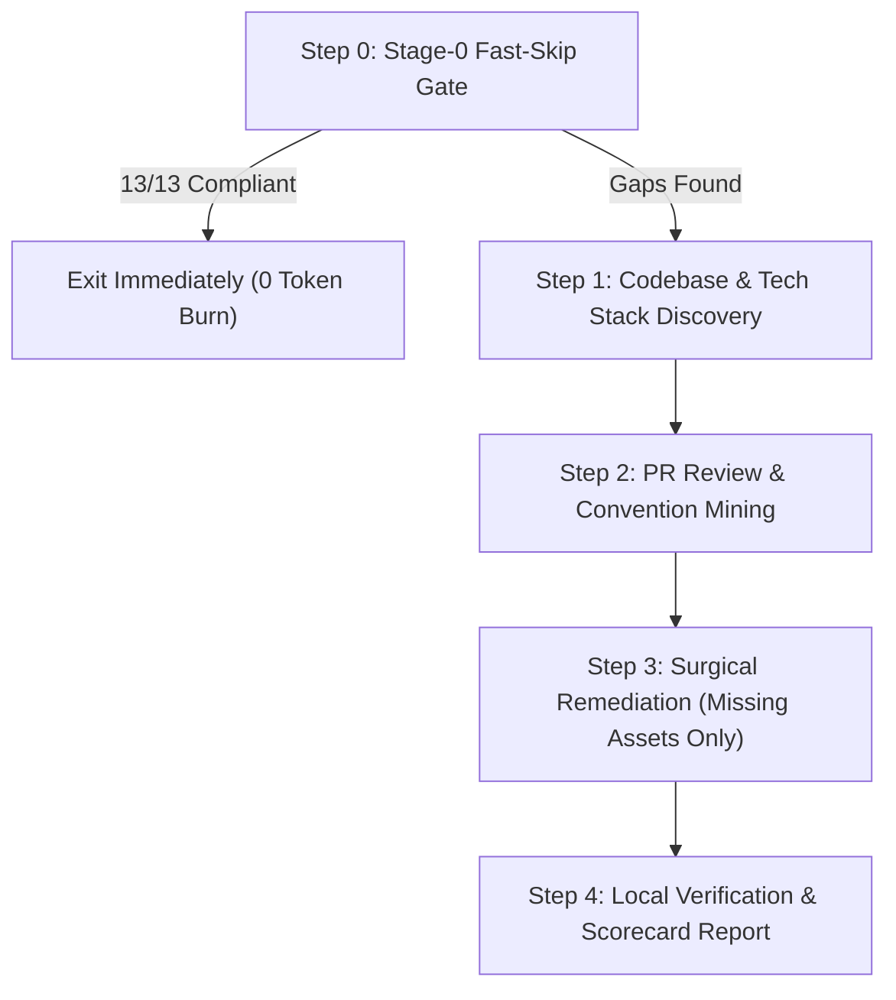

# 🤖 ai-ready — Repository AI-Readiness Auditor & Agent Engine Scaffolder

> **Aliases**: `repo-ai-ready` | `audit-ai-ready` | `ai-audit`
> **Canonical Home**: Holds the master Agent Engine DOX templates (`ai-ready/templates/`).
> **Core Mandate**: Eliminate agent guessing, guarantee zero token waste via Stage-0 Fast-Skip, and provide autonomous Agent Engine scaffolding.

`ai-ready` audits any software repository against **13 tracked assets** across AI Context, Dev Workflow, and Onboarding & Governance. It grades repositories across a 4-tier maturity matrix, houses the master Agent Engine DOX template canon, and surgically scaffolds missing configuration files without clobbering existing human work.

---

## When to Use

- User asks: *"Make this repo AI-ready"*, *"Audit AI readiness"*, *"Check repo health"*, *"Scaffold Agent Engine"*, or *"How AI-ready is this repo?"*.
- Invoked automatically as **Stage 0 Pre-Flight** inside `new-project` and `updateagents`.
- Upstream template canon provider for `new-project` (copying templates) and `updateagents` (synchronizing standards).
- Onboarding an existing codebase into autonomous AI workflows.
- Auditing whether an existing project suffers from context drift, missing templates, or unwritten conventions.
- Mining merged Pull Request reviews to surface implicit team conventions into explicit agent instructions.

---

## Quick Reference

### ⚡ Stage-0 Fast-Skip Gate (Zero Token Waste)
Before running detailed analysis, file generation, or PR mining, execute this high-speed pre-flight check:

```bash
# Rapid 12-Asset Presence Check
[ -f "AGENTS.md" ] && [ -d ".agents/standards" ] && [ -d ".agents/context" ] && \
{ [ -f ".mcp.json" ] || [ -d ".gemini" ] || [ -d ".agents" ] || [ -d ".cursor" ]; } && \
[ -f "llms.txt" ] && \
[ -d ".github/workflows" ] && [ -d ".github/ISSUE_TEMPLATE" ] && \
{ [ -f ".github/pull_request_template.md" ] || [ -f ".github/PULL_REQUEST_TEMPLATE.md" ]; } && \
[ -f ".github/dependabot.yml" ] && [ -f "CHANGELOG.md" ] && \
[ -f "CONTRIBUTING.md" ] && { [ -d "docs" ] || [ -d ".agents/context" ]; } && \
[ -f ".gitignore" ] && (rg -q "^\.e\[n\]v" .gitignore 2>/dev/null || grep -qE "^\.e\[n\]v" .gitignore) && \
[ -f ".env.example" ]
```

- **If ALL 13 assets are present and valid**:
  Emit exactly ONE line and exit immediately:
  ```text
  [ai-ready] Repository is AI-ready (13/13). Skipping pass.
  ```
  **Stop execution immediately. Do not burn tokens explaining what was skipped.**

- **If ANY asset is missing or stale**:
  Proceed to the targeted audit and remediation pipeline below, touching **only** the missing or delinquent assets.

---

## 📊 The 13 Tracked Assets & Scoring Rubric

### 1. 🤖 AI Context (What AI agents read to understand the repo)
| # | Asset | Canonical Path | Verification Criteria |
|:---|:---|:---|:---|
| 1 | **Root Agent Router** | `AGENTS.md` | Exists in root, strictly `<50 lines`, acts as a progressive disclosure routing table pointing to `.agents/`. |
| 2 | **DOX Hierarchy Tree** | `.agents/` | Complete 9-folder container (`standards`, `context`, `brand`, `archive`, `artifacts`, `goals`, `research`, `skills`, `workflows`). |
| 3 | **Tool / MCP Config** | `.mcp.json` or `.agents/`, `.cursor/`, `.gemini/` | Defines authorized MCP servers or project agent tools with scoped capabilities. `.agents/` is the universal folder any AI agent can use. |
| 4 | **AI Discovery Manifest** | `llms.txt` | Clean markdown index summarizing repo scope, key entrypoints, and documentation links for agent web crawlers. |

### 2. 🔧 Dev Workflow (What keeps PRs clean and agents on track)
| # | Asset | Canonical Path | Verification Criteria |
|:---|:---|:---|:---|
| 5 | **CI Verification Pipeline** | `.github/workflows/ci.yml` | Automated build, test, and type-check workflow triggered on PRs and pushes to `dev`/`main`. |
| 6 | **Issue Templates** | `.github/ISSUE_TEMPLATE/` | Markdown or YAML forms for Bug Reports and Feature Requests with reproduction steps. |
| 7 | **PR Review Template** | `.github/pull_request_template.md` | Structured template enforcing Why, What, Verification proof, and Anti-Slop checklist. |
| 8 | **Dependency Automation** | `.github/dependabot.yml` | Automated dependency monitoring configuration for package ecosystems. |

### 3. 📖 Onboarding & Governance (What prevents friction and enforces rules)
| # | Asset | Canonical Path | Verification Criteria |
|:---|:---|:---|:---|
| 9 | **Changelog** | `CHANGELOG.md` | Follows Keep a Changelog standard with an active `## [Unreleased]` section. |
| 10 | **Contributing Protocol** | `CONTRIBUTING.md` | Defines Conventional Commits (`<type>(<scope>): summary`), branch rules, and PR standards. |
| 11 | **Durable Documentation** | `docs/` or `.agents/context/` | Contains durable domain truth (`product.md`, `architecture.md`, `current.md`). |
| 12 | **Secret Hygiene & Guards** | `.gitignore` + `.env.example` | `.gitignore` explicitly excludes `.env*`, credentials, and temporary data; `.env.example` exists. |
| 13 | **Working Artifacts Container** | `.agents/artifacts/` | Folder exists with its `README.md` contract stub: research corpora, planning docs, and reports live in `.agents/artifacts/<topic>/`, never the repo tree, never `.memory/`; durable findings are promoted to `.agents/context/`. |

---

## 🏆 Scoring Maturity Matrix

Count the number of verified compliant assets (out of 13):

| Medal | Tier Name | Verified Score | Behavioral State |
|:---|:---|:---|:---|
| 🥉 | **Getting Started** | 1–5 / 13 | Basics in place, but agents guess conventions, drift, and lack CI gates. |
| 🥈 | **On Track** | 6–8 / 13 | Agents can assist, but lack architectural boundaries, issue hygiene, and secret guards. |
| 🥇 | **Solid** | 9–11 / 13 | High reliability; agents follow testing and branch conventions with minimal oversight. |
| 🏆 | **AI-Ready** | 12–13 / 13 | Peer-level autonomy; zero-slop PRs, self-verifying pipelines, and airtight context isolation. |

---

## Procedure



### Step 1: Codebase & Tech Stack Discovery
Inspect local files without modifying anything:
1. **Runtime & Package Manager**: Check `package.json`, `bun.lockb` / `bun.lock`, `pnpm-lock.yaml`, `Cargo.toml`, `pyproject.toml`, or `go.mod`.
2. **Test Framework**: Detect `bun test`, `vitest`, `jest`, `pytest`, or `cargo test`.
3. **Branching Model**: Check default and integration branches (`master`, `main`, `dev`).

### Step 2: PR Review & Convention Mining
Mine recent repository review history to capture implicit developer rules:
```bash
# Fetch last 15 merged PRs if gh CLI is available
gh pr list --state merged --limit 15 --json number,title,comments,reviews 2>/dev/null
```
- Identify repeated reviewer comments (e.g., *"always add unit tests"*, *"do not export default"*, *"prefer server actions"*).
- Synthesize durable rules into `.agents/standards/execution-kernel.md` or `.agents/context/decisions.md`.

### Step 3: Targeted Remediation (Surgical Fixes)
Only scaffold what is missing. Never overwrite human-authored configuration files without explicit user approval:

```bash
# Automated Provisioning via ai-ready CLI
bun path/to/ai-ready/scripts/ai-ready.ts [targetPath] --scaffold

# Simulation Mode
bun path/to/ai-ready/scripts/ai-ready.ts [targetPath] --scaffold --dry-run
```

1. **Missing `AGENTS.md`**: Deploy lean DOX routing rail (`<50 lines`) from `ai-ready/templates/AGENTS.md`.
2. **Missing `.agents/` Container**: Provision the 9-folder structure with 13 standard baseline modules (including WordPress) from `ai-ready/templates/.agents/`.
3. **Missing `llms.txt`**: Generate a clean markdown index of the repository purpose, documentation, and public APIs.
4. **Missing CI Workflow**: Generate `.github/workflows/ci.yml` running linter and tests matching detected stack.
5. **Missing Issue / PR Templates**: Drop standard bug/feature templates and anti-slop PR verification checklist.
6. **Missing Security / Secret Guards**: Ensure `.env` is in `.gitignore` and generate `.env.example` with empty keys.
7. **Missing `.github/` Bundle**: Deploy `dependabot.yml`, bug/feature issue templates, and the anti-slop PR template from `ai-ready/templates/github/` — never overwriting existing files.
8. **Missing `.mcp.json` / `llms.txt`**: Deploy the least-privilege tool-config template and the discovery-index skeleton for the team to refine with real repository facts.

For CI gating, run the audit with `--fail-under N`: the process exits `1` when the verified score is below `N`.

### Step 4: Verification & Scorecard Report
Print the structured AI-Readiness scorecard:
```text
============================================================
  AI-READY AUDIT REPORT
============================================================
  Score: 12 / 12 (🏆 AI-Ready)
  Status: All systems operational & verified.
------------------------------------------------------------
  [✓] AI Context: AGENTS.md (<50 lines router)
  [✓] AI Context: .agents/ 9-folder DOX container
  [✓] AI Context: .mcp.json tool configuration
  [✓] AI Context: llms.txt agent discovery manifest
  [✓] Dev Workflow: .github/workflows/ci.yml
  [✓] Dev Workflow: .github/ISSUE_TEMPLATE/ (Bug & Feature)
  [✓] Dev Workflow: .github/pull_request_template.md
  [✓] Dev Workflow: .github/dependabot.yml
  [✓] Onboarding: CHANGELOG.md (Keep a Changelog standard)
  [✓] Onboarding: CONTRIBUTING.md (Conventional Commits)
  [✓] Onboarding: Durable documentation structure
  [✓] Onboarding: Secret hygiene (.gitignore & .env.example)
============================================================
```

---

## Pitfalls

1. **No Monolithic Dumps**: Never dump hundreds of lines of rules into root `AGENTS.md`. It must stay `<50 lines`.
2. **Zero Clobbering**: Never overwrite existing custom configurations, tests, or scripts without confirmation.
3. **Strict MuseMemory Boundary**: Never touch, audit, or clean `.memory/**`. That directory is exclusively owned by MuseMemory.
4. **No Artificial Token Burn**: Never emit essays when the repository is already compliant. Respect the Fast-Skip Gate.
5. **Zero Synthetic ADE Artifacts**: Never accept or commit `[[ORCA_RICH_MD:...]]`, Cursor markers, or Claude artifacts. Run `bun ai-ready.ts --sanitize` or unwrap them before saving.
6. **Modern CLI Primacy**: Always invoke modern CLI tools (`fd`, `rg`, `bat`, `eza`) explicitly by name; never rely on `.bashrc` aliases in non-interactive agent subshells.
7. **No Published Git Refs in Package Specs**: Never output, publish, or append trailing `#<ref>` or commit SHAs in package targets (`skills add <owner>/<repo>`). Downstream installers invoke `git clone --depth 1 --branch <ref>`, which fatally rejects raw commit SHAs.


---

## Verification

- [ ] Fast-Skip Gate exits in `<100ms` with zero modifications on already-compliant repos.
- [ ] Root `AGENTS.md` template is strictly `<50 lines`.
- [ ] All 13 assets are tested against detection patterns in `references/twelve-asset-matrix.md`.
- [ ] PR review mining gracefully falls back if GitHub CLI / network is unavailable.
- [ ] `--fail-under N` exits `1` when the score is below `N` and `0` otherwise.
- [ ] Passes `bun test tests/skills.test.ts`.
