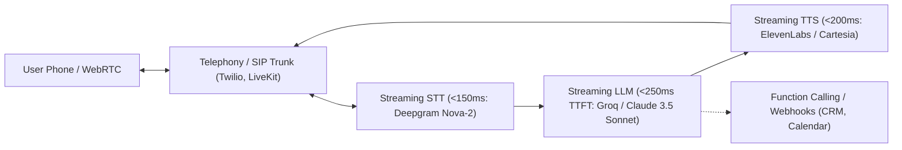

# voice — Real-Time Conversational Voice AI Agents & Telephony

> **Operating Principle**: Human telephone conversations require sub-600ms round-trip latency (from user speech end to agent audio output). Anything above 800ms feels mechanical and awkward. A production voice agent couples low-latency streaming Speech-to-Text (STT), fast LLM inference (with token streaming), ultra-realistic Text-to-Speech (TTS), and native telephony (Twilio / SIP trunking) with human handoff escalation paths.

---

## The Voice AI Stack Architecture



---

## Platform Selector & Deployment Matrix

| Provider / Tool | Best For | Typical Latency | Key Feature |
| :--- | :--- | :--- | :--- |
| **Retell AI** | Turnkey production voice agents, instant Twilio import | 500 – 700ms | Built-in backchanneling, interruptions, ambient noise cancellation |
| **Bland AI** | High-scale outbound sales/qualification calling | 600 – 850ms | Custom enterprise telephony routing, automated voicemail detection |
| **LiveKit Agents** | Sovereign open-source Python/Node.js voice pipelines | 400 – 600ms | Complete pipeline ownership, multi-modal WebRTC, zero vendor lock-in |
| **Twilio Voice + Media Streams** | Custom SIP gateway & carrier compliance | Carrier standard | Native carrier number porting, A2P/STIR-SHAKEN verification |

---

## Inbound Receptionist & Call Routing Blueprint

### Prompt Engineering for Voice vs Text
- **Sentence Length**: Maximum 15–20 words per clause. Keep speech concise.
- **Phonetic Pronunciations**: Spell out uncommon words phonetically (e.g. *"Acme: ACK-mee"*).
- **Filler & Backchanneling**: Inject subtle affirmations (*"Got it"*, *"Understood"*, *"Sure thing"*) to acknowledge caller input during function execution.

### Function Calling & Real-Time Tool Execution
```json
{
  "name": "book_calendar_slot",
  "description": "Book a 15-minute consultation on the sales calendar",
  "parameters": {
    "type": "object",
    "properties": {
      "caller_name": { "type": "string" },
      "preferred_time": { "type": "string", "description": "ISO 8601 datetime" },
      "phone_number": { "type": "string" },
      "project_type": { "type": "string", "enum": ["ecom", "saas", "design", "general"] }
    },
    "required": ["caller_name", "preferred_time", "phone_number"]
  }
}
```

---

## Human Warm Transfer & Escalation Guardrails

Voice agents must recognize when to bow out gracefully:
1. **Frustration / Sentiment Triggers**: Immediate escalation if caller repeats *"representative"*, *"human"*, or sentiment score drops below threshold.
2. **Cold Call Transfers**: Using Twilio `<Dial>` or Retell transfer action:
   ```json
   {
     "action": "transfer_call",
     "target_number": "+18005550199",
     "transfer_summary": "Caller Jordan Taylor asking about enterprise SLA terms."
   }
   ```
3. **Voicemail Drop & SMS Follow-up**: If call is unanswered or hits voicemail, automatically drop a tailored message and trigger a confirmation SMS via `crm:sms`.

---

## Legal & Compliance Telephony Guardrails
- **TCPA Compliance**: Outbound AI calling requires prior express written consent.
- **Two-Party Consent Recording Notice**: Mandatory opening disclosure: *"Hi, thanks for calling {{COMPANY}}. This call is recorded and assisted by AI for quality assurance."*
- **STIR/SHAKEN Caller ID Attestation**: Verify A-level attestation on sending numbers to prevent "Spam Likely" labeling by carriers.
