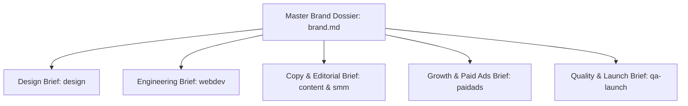

# brief — Master Cross-Department Synthesis Dossier

> **Operating Principle**: Raw client onboarding notes and sprawling questionnaires are useless to execution engineers and designers. The `brief` mode acts as the authoritative synthesizer, translating discovery data into crisp, highly structured departmental sub-briefs tailored specifically for `design`, `webdev`, `content`, `paidads`, and `qa-launch`.

---

## The Master Brand Dossier Architecture

Upon completion of `intake`, `research`, and `accounts-access`, compile the client's durable source of truth to:
`.agents/context/brand.md`

From this master document, generate 5 specialized execution briefs:

---

### Department Brief 1: For `design` (Visual Identity & Layouts)
- **Primary Aesthetic Archetype**: Minimalist Swiss-print, Dark Technical Ceramic, Bold High-Contrast Fintech, or Warm Organic Editorial.
- **Design Tokens (DTCG format)**:
  - Color Tokens: Primary, Secondary, Neutral, Surface, Border, Semantic Accent (HEX & OKLCH values).
  - Typography: Display, Heading, Body, Code font families and size scales.
  - Spatial Scale: 4px base grid with intra/inter spacing ratios.
- **Logo Assets**: Path to verified vector `.svg` assets.
- **Target Page Archetypes**: SaaS landing page (9-section canonical template in `design/templates/saas.md`), Dashboard layout, or E-commerce product showcase.

---

### Department Brief 2: For `webdev` (Technical Architecture)
- **Target Tech Stack**: Next.js 14 App Router, Astro, or Hono; Tailwind CSS or UnoCSS Wind 4.
- **CMS & Data Stores**: Headless Payload, WordPress Bedrock, Supabase Postgres, or Redis.
- **Repository Topology**: GitHub repository URL, branch strategy (`dev` -> `main`), and PR conventions.
- **Deployment & Hosting**: Cloudflare Pages / Workers or Vercel, DNS routing, and custom domain setup.
- **Performance Budget**: p95 LCP $\le 1.8\text{s}$, CLS $\le 0.05$, bundle size $\le 120\text{kB}$ initial JS.

---

### Department Brief 3: For `content` & `smm` (Messaging & Copywriting)
- **Brand Voice Vector**: Formality score (1–10), Technical density (1–10), Humor/Wit allowance (1–10).
- **Approved Claims Library**: Verified ROI metrics, client case study figures, and customer testimonials (zero unverified claims).
- **Forbidden Vocabulary**: Banned buzzwords (e.g. *seamless*, *robust*, *cutting-edge*, *elevate*, *empower*).
- **Copywriting Formula Selection**: Recommended page formulas from `content:copy` (e.g. AIDA, PAS, QUEST, ACCA, DOS, Belcher 21-Part).
- **SEO/AEO Directives**: Primary keyword clusters, 18-token standalone quotability rule, answer-first formatting, and Article/FAQ schema requirements.

---

### Department Brief 4: For `paidads` (Paid Acquisition & Tracking)
- **Assigned Ad Accounts**: Meta Business Manager ID, Google Ads CID, TikTok Ads ID.
- **Tracking & Pixel Infrastructure**: GTM Container ID, GA4 Measurement ID, Meta Pixel/CAPI dataset.
- **Budget & Targets**: Monthly ad spend, target Cost Per Acquisition (CPA), target ROAS, target CPL.
- **Angle White Space**: Proven competitor angles from research vs differentiated brand hooks.

---

### Department Brief 5: For `qa-launch` (Quality Verification & Gates)
- **Device & Viewport Matrix**: Target mobile devices (iPhone 13/14/15, Samsung Galaxy S23), tablet (iPad), desktop (1366x768, 1920x1080).
- **Browser Matrix**: Chrome, Safari (macOS & iOS WebKit), Firefox, Edge.
- **Critical Path Workflows**: Sign-up flow, checkout/payment flow, contact/demo booking form.
- **Compliance Checks**: Privacy Policy, Terms of Service, Cookie banner (GDPR/CCPA), WCAG 2.2 AA accessibility pass.

---

## Deliverables

1. Master Brand Dossier: `.agents/context/brand.md`
2. Departmental Execution Briefs: `.agents/artifacts/brand/department-briefs.md`

---

## Quality Gate

- [ ] Master Brand Dossier synthesized and saved to `.agents/context/brand.md`.
- [ ] All 5 departmental sub-briefs contain complete, concrete specifications (no "TBD" placeholders).
- [ ] Voice vectors, forbidden words, and approved claims defined for content and social teams.
- [ ] Tech stack, repos, and performance budgets locked for engineering.
- [ ] Tracking IDs and conversion goals verified for paid acquisition.
