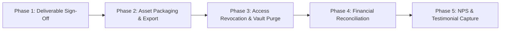

# offboard — Client & Brand Offboarding Protocol

> **Operating Principle**: The offboarding experience is the final impression an agency leaves. A sloppy, contentious, or unorganized handover destroys goodwill, creates security vulnerabilities, and prevents repeat business and referrals. Professional offboarding guarantees asset integrity, enforces total security revocation within 48 hours, and turns satisfied clients into long-term brand advocates.

---

## 5-Phase Offboarding Execution Protocol



### Phase 1: Final Deliverable Audit & SOW Sign-Off
1. Review the initial Statement of Work (SOW) milestone checklist with the client.
2. Confirm that 100% of agreed deliverables (code, design assets, campaigns, documentation) have been delivered and accepted in writing.
3. Emit the official **Project Completion Sign-Off Form**.

### Phase 2: Asset Packaging & Custody Transfer
1. **Design Assets**:
   - Figma project transfer to client's Figma organization (or export `.fig` source archives).
   - Export SVG/PNG master icon packs, brand guideline PDFs, and typography license links.
2. **Code & Engineering Assets**:
   - Merge all final feature branches into `main`.
   - Ensure README, deployment docs, and environment variables template (`.env.example`) are up to date.
   - Transfer GitHub/GitLab repository ownership or remove agency team members.
3. **Domain & Infrastructure Handover**:
   - Transfer DNS management (Cloudflare account transfer or Nameserver update).
   - Ensure client billing details are active on Vercel, AWS, or host provider so services do not pause.

### Phase 3: Access Revocation & Security Vault Purge (48-Hour SLA)
Within 48 hours of project sign-off, systematically revoke all agency access to client accounts:
- **Meta Business Suite**: Remove Agency Partner Access from Client Ad Accounts, Pages, and Pixels.
- **Google Ads**: Unlink Client CID from Agency MCC.
- **Google Tag Manager & GA4**: Remove agency email addresses from user permissions.
- **Cloudflare & Hosting**: Remove agency members from team accounts.
- **Stripe / Payment Gateways**: Remove agency developers from Stripe team members.
- **Local Purge**: Run `clean-system-cache` and purge any local client staging caches or environment files.
- Emit the signed **Access Revocation Certificate**.

### Phase 4: Final Financial Reconciliation
- Coordinate with `accounts` skill to verify:
  - Final milestone invoice dispatched and marked `PAID`.
  - Out-of-scope change requests settled.
  - Zero outstanding balances or unbilled third-party SaaS charges.

### Phase 5: Client NPS & Reverse Testimonial Capture
1. Dispatch the Net Promoter Score (NPS 1–10) inquiry.
2. Deploy the **6-Question Reverse Testimonial Engine** (from `content:copy`):
   - *What was your biggest hesitation before hiring our agency?*
   - *What was the actual experience of working with our team?*
   - *What specific deliverable or result exceeded your expectations?*
   - *What measurable business outcome (traffic, signups, revenue) did you achieve?*
   - *Would you recommend our agency to other founders/executives, and why?*
   - *Any final feedback for our team?*
3. Introduce the Agency Referral Offer (mutual retainer credit for referred brands).

---

## Deliverable

Save the offboarding record to:
`.agents/context/offboarding-record.md`

### Schema:
```markdown
# Offboarding Record: [Client Name]
- **Completion Date**: [YYYY-MM-DD]
- **Project Lead**: Muse Agency Orchestrator
- **Status**: [COMPLETED_REVOKED]

## 1. Deliverable Verification Checklist
- [x] Webdev Repository Transferred
- [x] Design Figma Sources Exported
- [x] Documentation & README Delivered

## 2. Access Revocation Log (48h SLA)
- [x] Meta Partner Unlinked
- [x] Google Ads MCC Unlinked
- [x] GTM / GA4 Access Removed
- [x] Cloudflare Member Removed
- [x] Stripe Developer Member Removed

## 3. Financial Reconciliation
- **Final Invoice Status**: PAID (Txn ID: ...)

## 4. Client Review & NPS
- **NPS Score**: 10/10
- **Testimonial Quote**: ...
```

---

## Quality Gate

- [ ] All SOW milestones confirmed complete and signed off by client.
- [ ] Code repositories, Figma files, and DNS custody transferred.
- [ ] 100% of agency permissions revoked across Meta, Google, GTM, GA4, Cloudflare, and Stripe.
- [ ] Zero client credentials, session tokens, or local env files remaining in agency workspaces.
- [ ] Final invoice paid in full.
- [ ] NPS and testimonial survey dispatched.
