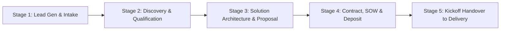

# pipeline — End-to-End Agency Sales Pipeline & Qualification Engine

> **Operating Principle**: The agency sales pipeline is not merely a tracking list; it is a rigorous qualification filter. Taking on bad-fit clients with misaligned budgets, undefined authority, or unrealistic timelines burns team morale and drains profitability. The pipeline ensures only qualified, high-conviction prospects transition into full agency onboarding.

---

## 5-Stage Agency Sales Pipeline



### Stage 1: Lead Intake & First Touch
- **Lead Origin**: Inbound (organic search, referral, content) or Outbound (GTM campaign, cold outreach).
- **Initial Profile**: Company name, primary domain, contact email, stated project need, estimated budget bracket.
- **Speed to Lead Protocol**: Respond within $< 4$ business hours with a low-friction diagnostic question or booking calendar link.

### Stage 2: Discovery & Qualification (BANT & MEDDIC)
Evaluate the opportunity across the dual qualification frameworks:

#### 1. BANT Framework Scoring:
- **Budget**: Does the prospect have budget allocated that meets agency minimum retainers ($5k/mo or $15k project minimum)?
- **Authority**: Is the person on the call the Economic Buyer with signing authority, or an evaluation champion?
- **Need**: Is the problem an existential business bottleneck (growth, conversion, re-architecture) or a casual "nice-to-have"?
- **Timeline**: Is there a concrete target launch date or event driving urgency ($< 60$ days)?

#### 2. MEDDIC Enterprise Qualification (for $25k+ engagements):
- **Metrics**: What quantified KPI must improve? (e.g., CAC slashed by 30%, signups up 2x).
- **Economic Buyer**: Direct relationship established with the P&L owner.
- **Decision Criteria**: What technical and commercial metrics will govern vendor selection?
- **Decision Process**: What are the legal, security, and procurement approval steps?
- **Identify Pain**: What happens to their business if they do nothing?
- **Champion**: Is there an internal stakeholder actively fighting for us?

### Stage 3: Solution Architecture & Proposal Blueprint
Synthesize the client's problem into a 3-tier proposal:
1. **Tier 1 (Foundational / MVP)**: Solves the single most critical bottleneck.
2. **Tier 2 (Recommended / Full Transformation)**: Complete end-to-end design, webdev, content, and tracking implementation.
3. **Tier 3 (Accelerated / Enterprise Retainer)**: Full build plus ongoing monthly growth, optimization, and SLA monitoring.
- *Strict Rule*: State deliverables, milestones, assumptions, and explicit exclusions (what is NOT included).

### Stage 4: Contract, SOW & Payment Kickoff
1. Send Statement of Work (SOW) and Master Services Agreement (MSA).
2. Issue the upfront milestone invoice (50% upfront deposit required before work begins).
3. Coordinate with `accounts` for gateway clearing (Stripe / Razorpay / Wire).

### Stage 5: Handover to Agency Delivery Council
Once deposit clears:
- Transition record from `pipeline` to `brand:intake` and `brand:accounts-access`.
- Brief the Agency Council: Sol (Architecture/Webdev), Jasper (Creative/Design), Crew (Delivery/Ops), Nexus (Review Head).

---

## Deliverable

Save the pipeline status to:
`.agents/context/pipeline-opportunity.md`

### Schema:
```markdown
# Opportunity Record: [Client Name]
- **Pipeline Stage**: [DISCOVERY | QUALIFIED | PROPOSAL_SENT | WON_ONBOARDING | LOST]
- **Deal Value**: [$XX,XXX]
- **Economic Buyer**: [Name, Title, Email]

## BANT / MEDDIC Qualification Score
- **Budget**: [CONFIRMED | AMBIGUOUS | DEFICIENT]
- **Authority**: [DECISION_MAKER | INFLUENCER]
- **Need**: [HIGH_URGENCY | MODERATE]
- **Timeline**: [HARD_DEADLINE: YYYY-MM-DD]
- **Overall Fit**: [QUALIFIED_PROCEED | DISQUALIFY_POLITELY]

## Proposal Summary & Options
...

## Handover Checklist to Delivery
- [ ] SOW Signed
- [ ] 50% Deposit Received
- [ ] Kickoff Date Scheduled
```

---

## Quality Gate

- [ ] Lead evaluated against BANT and MEDDIC criteria before proposal drafting.
- [ ] Pricing options include clear milestone payments and explicit exclusions.
- [ ] Upfront deposit policy enforced: zero production delivery before first payment.
- [ ] Opportunity record updated with economic buyer and decision criteria.
- [ ] Clean handover executed to `ops` and `accounts`.
