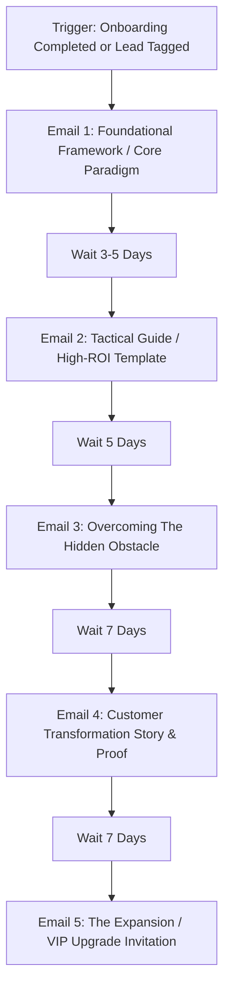

# nurture — Educational Drip Sequences & Customer Expansion

> **Operating Principle**: Nurture sequences turn newly activated users and leads into loyal power users and repeat buyers. The goal is relentless value delivery, habit formation, and education—never spamming product updates or aggressive discounts without substance.

---

## Intake & Prerequisites

Before building a nurture sequence, verify:
- **Audience Segment**: Leads (pre-purchase), active free users, or paying customers.
- **Drip Cadence**: Evergreen weekly/bi-weekly or event-driven (milestone completion).
- **Core Educational Themes**: Top 3 problems the customer faces and how the methodology solves them.
- **Expansion Milestone**: Trigger condition for upsell, cross-sell, or annual plan migration.

---

## The Evergreen Nurture Architecture



---

## Blueprint & Email Specifications

### Email 1: The Core Framework / Paradigm Shift
- **Timing**: 3–5 days after onboarding completion.
- **Focus**: Introduce the mental model or framework behind why standard industry approaches fail and how the client's system succeeds.
- **CTA**: Read full breakdown or implement step 1.

### Email 2: The Tactical Template / Tear-Sheet
- **Timing**: 5 days after Email 1.
- **Focus**: High-utility asset (worksheet, code snippet, cheat-sheet, or prompt library) that yields immediate ROI.
- **CTA**: Direct download or duplicate template link.

### Email 3: The Common Bottleneck & Solution
- **Timing**: 7 days after Email 2.
- **Focus**: Unpack the most frequent trap users fall into at this stage and provide a 3-step mitigation recipe.
- **CTA**: Check account settings / activate helper tool.

### Email 4: Proof & Customer Transformation
- **Timing**: 7 days after Email 3.
- **Focus**: Deconstruct how a peer customer achieved a specific outcome (e.g., 3.2x ARR, 45% churn reduction) using specific platform workflows.
- **CTA**: Explore feature walkthrough.

### Email 5: Expansion & Upgrade Invitation
- **Timing**: 7 days after Email 4.
- **Focus**: Introduce higher-tier capabilities (Enterprise features, agency retainers, annual billing discount, or dedicated coaching).
- **CTA**: Book consultation or upgrade account with priority onboarding.

---

## ESP Engine Event & Tagging Spec

```json
{
  "flow_name": "Evergreen Nurture Engine",
  "trigger": {
    "type": "event_or_segment",
    "event": "onboarding_completed",
    "filter": {
      "subscription_status": "active",
      "churn_risk": "low"
    }
  },
  "sequence_length": 5,
  "cadence_days": [3, 5, 7, 7, 7],
  "exit_conditions": [
    "unsubscribed",
    "support_ticket_urgent",
    "plan_upgraded_to_enterprise"
  ]
}
```

---

## Verification & Best Practices
- **Value-to-Pitch Ratio**: Maintain at least 80% education/tactics and 20% commercial pitch.
- **Dynamic Content**: Personalize with company name, industry vertical, and actual usage stats where available.
- **Deliverability Gate**: Ensure unsubscribe link is distinct and 1-click RFC 8058 compliant.
