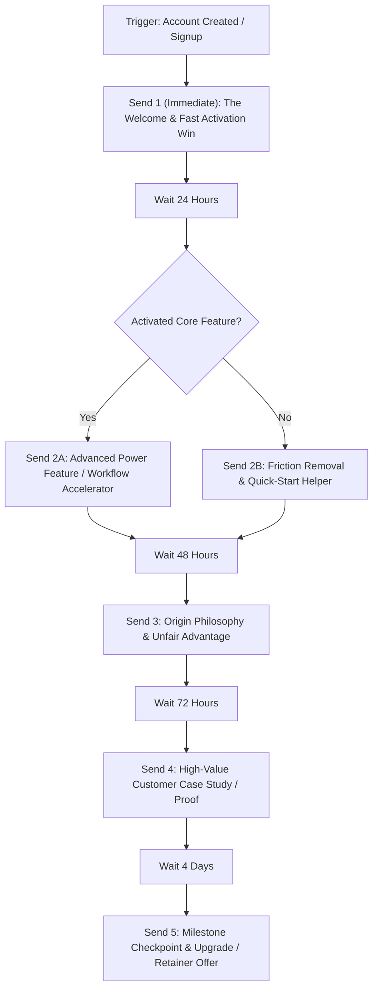

# onboard — Welcome & Product Activation Onboarding Flows

> **Operating Principle**: The welcome and onboarding sequence is the single highest-engagement moment in the customer lifecycle (average open rates >50%). Its purpose is not to overwhelm the user with feature dumps, but to guide them swiftly to their **first product activation win** (Time-to-Value < 15 minutes).

---

## Intake & Prerequisites

Before drafting or configuring the onboarding flow, verify:
- **Core Product Activation Metric**: The specific action that proves adoption (e.g. creating first project, connecting database, purchasing first product).
- **Trigger Event**: `user_signup`, `account_created`, or `first_order_completed`.
- **Target Audience & Tone**: Ingested from `.agents/brand/voice.md` and `.agents/brand/personas.md`.
- **ESP Stack**: Klaviyo, Resend, Customer.io, Postmark, Loops, or Mailgun.

---

## The Canonical 5-Stage Onboarding Flow Architecture

---

## Detailed Sequence Blueprint

### Send 1: The Instant Welcome & First Activation Win
- **Timing**: Sent immediately upon trigger (`delay: 0m`).
- **Subject Line Archetype**: Direct Access / Friction Remover (*"Welcome to {{PROJECT_NAME}} — here is your quick start link"*).
- **Primary Goal**: Immediate login and initial activation.
- **Copy Structure**:
  1. Welcome warmly without fluff.
  2. One single clear action button: **[Start Your Setup in 3 Minutes]**.
  3. 3-step bulleted checklist of what to do first.
  4. P.S. note offering direct human support.

### Send 2: The Core Mechanism & Friction Buster
- **Timing**: 24 hours after Send 1.
- **Branching**:
  - If user **has completed activation**: Introduce workflow shortcuts and power-user tips.
  - If user **has NOT completed activation**: Address the #1 common stumbling block with a 90-second video demo or GIF.
- **Primary Goal**: Overcome initial hesitation and achieve second session return.

### Send 3: Origin Story & The "Why Us" Philosophy
- **Timing**: 48 hours after Send 2.
- **Subject Line Archetype**: Contrarian / Curiosity (*"Why we built {{PROJECT_NAME}} without legacy bloat"*).
- **Primary Goal**: Emotional alignment and brand conviction.
- **Copy Structure**:
  1. Contrast the old, painful status quo with the purpose-built modern mechanism.
  2. Grounded in `.agents/brand/positioning.md`.
  3. No sales push—pure alignment and respect for the user's intelligence.

### Send 4: Customer Proof & Tangible ROI
- **Timing**: 72 hours after Send 3.
- **Primary Goal**: Third-party conviction and FOMO.
- **Content**: Concrete case study metrics (e.g. *"How [Customer] cut delivery time by 64% in their first 14 days"*).

### Send 5: Milestone Review & Next Tier Offer
- **Timing**: Day 10–12 after signup.
- **Primary Goal**: Transition from trial to paid subscription or annual tier.
- **Offer**: Clear deadline or value incentive (dedicated onboarding call, annual discount, bonus credits).

---

## Quality Gate

- [ ] Every send has exactly ONE primary call-to-action button/link.
- [ ] Conditional branching logic separates activated users from inactive signups.
- [ ] Subject lines pass the 40–60 character brevity rule with preview text extending the meaning.
- [ ] Anti-puffery check passed: 0 instances of *"game-changing"*, *"revolutionary"*, or *"cutting-edge"*.
- [ ] Unsubscribe and physical address footer fully compliant with CAN-SPAM and GDPR.
