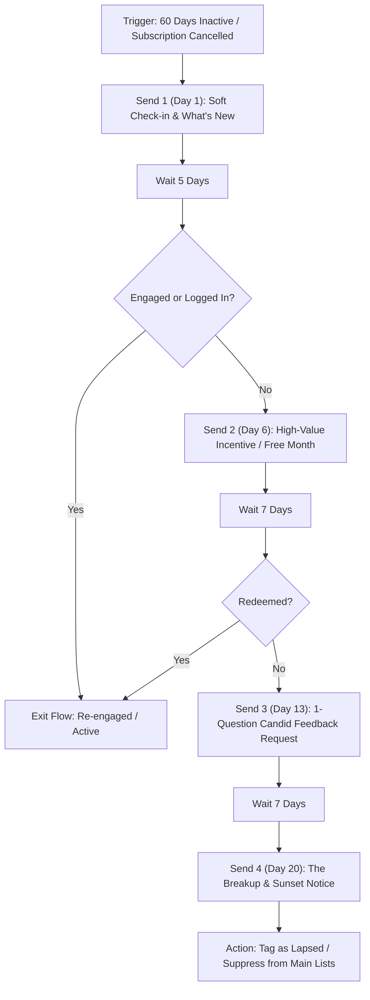

# winback — Customer Reactivation & Churn Recovery Flows

> **Operating Principle**: Reactivating a dormant or lapsed customer costs up to 5x less than acquiring a new customer from cold traffic. A structured winback sequence diagnoses why the user stopped engaging, removes the blocker, offers a compelling reactivation reason, and gracefully sunsets unresponsive profiles to safeguard domain reputation.

---

## Intake & Prerequisites

Before drafting a winback flow, verify:
- **Dormancy Threshold**: Definition of inactive (e.g. 30, 60, or 90 days without login, order, or session).
- **Churn Reason Data**: Exit survey responses or cancellation reason tags if available.
- **Reactivation Incentive**: Exclusive discount, extended trial, feature grandfathering, or complimentary audit/consultation.
- **Sunsetting Policy**: Hard cutoff after which cold profiles are permanently tagged `unengaged` and excluded from bulk sends.

---

## The 4-Stage Winback Flow Architecture

---

## Sequence Execution Blueprint

### Send 1: The Casual Check-in & Major Feature Highlights
- **Timing**: Sent at dormancy trigger (Day 1).
- **Subject Line Archetype**: Low pressure / Curiosity (*"Things have changed since your last visit, {{FIRST_NAME}}"*).
- **Core Message**: Highlight the 2–3 biggest improvements, bug fixes, or speed upgrades launched since their last visit.
- **CTA**: Direct 1-click login back into their workspace/dashboard.

### Send 2: The Direct Incentive / Unblocker
- **Timing**: 5 days after Send 1 if unengaged.
- **Subject Line Archetype**: Direct Benefit (*"A gift to welcome you back to {{PROJECT_NAME}}"*).
- **Core Message**: Eliminate financial or setup resistance with a tangible offer (e.g., 20% off next 3 months, 1 free consultation hour, or reactivation bonus credits).
- **CTA**: Claim offer before expiration date (5-day validity creates natural urgency).

### Send 3: The 1-Question Honest Feedback Request
- **Timing**: 7 days after Send 2 if no conversion.
- **Subject Line Archetype**: Founder Personal Check-in (*"Quick question about {{PROJECT_NAME}}"*).
- **Core Message**: Plain-text styling, signed by founder or product lead. *"Did we miss something, was it too complicated, or did you pivot?"*
- **CTA**: Reply directly to the email. (Replies also dramatically boost domain deliverability and ISP trust).

### Send 4: The Clean Breakup & Sunset Notice
- **Timing**: 7 days after Send 3.
- **Subject Line Archetype**: Finality / Permission (*"Should we remove your account?"*).
- **Core Message**: Respectful notice stating that we will stop sending emails to keep their inbox clean unless they confirm they want to stay.
- **CTA**: **[Keep Me Subscribed]** button.
- **Automation Action**: If not clicked within 7 days, tag profile with `suppressed_dormant` and exclude from all general campaigns.

---

## Automation Rules & Guardrails
- **Safety Exit**: Any purchase, login, or billing event immediately terminates the winback sequence.
- **Reputation Protection**: Send winback emails only to addresses that passed DKIM/DMARC and never hard-bounced.
- **Exclusion Filters**: Filter out users with open billing dispute tickets or active chargebacks.
