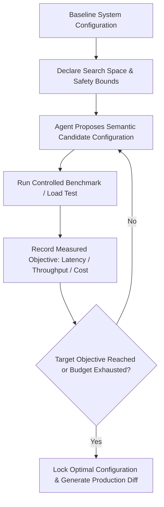

# tuning — Automated System Parameter Tuning & Benchmark Optimization

Operational formulas, closed-loop semantic parameter tuning, and configuration scripts for PostgreSQL and MySQL query engine tuning, memory pools, connection sizing, and index maintenance.

## Scope

- Iterative parameter optimization for database connection pools, cache TTLs, vector search quantization, and API worker concurrency.
- Semantic parameter reasoning: proposing candidates based on what each parameter means in context rather than blind numerical grid search.
- Closed-loop objective evaluation: measuring p95/p99 latency, memory consumption, throughput, and infrastructure cost.
- Fallback guardrails to prevent system crashes, memory exhaustion, or database connection starvation.

## Deliverable

A Parameter Optimization Log with baseline vs optimized benchmarks, convergence graphs, and production configuration diffs.

## The Semantic Optimization Loop



---

## Common Agency Optimization Targets

### 1. Database Connection Pooling (PostgreSQL / Supabase / Neon)
- **Parameters to Tune**:
  - `max_connections` (Pool upper limit).
  - `idle_timeout` (Connection reuse window).
  - `statement_timeout` (Slow query circuit breaker).
- **Objective**: Minimize connection queue time under concurrent load while avoiding database `too many clients` fatal errors.

### 2. Redis & Cache Invalidation TTLs
- **Parameters to Tune**:
  - `default_ttl` (Cache longevity).
  - `stale_while_revalidate` (Background refresh window).
  - `max_memory_policy` (`allkeys-lru` vs `volatile-lru`).
- **Objective**: Maximize Cache Hit Rate (>90%) without serving stale data past business tolerance.

### 3. Vector Search Indexing & Quantization (Qdrant / pgvector)
- **Parameters to Tune**:
  - `m` (Max connections per HNSW node: 16 to 64).
  - `ef_construct` (Index construction precision: 64 to 512).
  - Quantization Mode: `None` (Full float32) vs `Scalar` (int8, 4x memory compression) vs `Binary` (1-bit, 32x compression).
- **Objective**: Achieve sub-20ms search latency while maintaining cosine similarity recall above 95%.

### 4. Background Job Concurrency
- **Parameters to Tune**:
  - `worker_concurrency` (Parallel threads/processes).
  - `batch_size` (Items processed per database transaction).
- **Objective**: Maximize throughput without saturating CPU or triggering external API rate limits.

---

## Production Memory Calibration Formulas

### 1. PostgreSQL Memory Pool Calibration

#### A. Core Parameters
```sql
-- 1. Shared Buffers (Target: 25% of dedicated RAM, max 40%)
-- For a 16GB RAM database server:
ALTER SYSTEM SET shared_buffers = '4GB';

-- 2. Effective Cache Size (Estimated OS + DB cache available; target: 50% - 75% RAM)
-- For 16GB RAM:
ALTER SYSTEM SET effective_cache_size = '12GB';

-- 3. Work Memory (Per sorting/hashing operation)
-- Formula: (Total RAM * 0.25) / max_connections
-- For 16GB RAM, max_connections = 100: (4GB) / 100 = ~40MB
ALTER SYSTEM SET work_mem = '40MB';

-- 4. Maintenance Work Memory (For VACUUM, CREATE INDEX, ALTER TABLE)
ALTER SYSTEM SET maintenance_work_mem = '2GB';
ALTER SYSTEM SET autovacuum_work_mem = '512MB';

-- Reload configuration without downtime
SELECT pg_reload_conf();
```

#### B. Cache Hit Ratio Verification
```sql
-- Target: > 99% hit ratio
SELECT
    sum(heap_blks_read) as heap_read,
    sum(heap_blks_hit) as heap_hit,
    round(sum(heap_blks_hit) / nullif(sum(heap_blks_hit) + sum(heap_blks_read), 0) * 100, 2) as cache_hit_ratio
FROM pg_statio_user_tables;
```

---

### 2. MySQL / InnoDB Memory Calibration

```ini
[mysqld]
# 1. InnoDB Buffer Pool Size (Target: 70% - 80% of dedicated RAM)
# For 16GB RAM server:
innodb_buffer_pool_size = 12G

# 2. Buffer Pool Instances (1 instance per 1GB-2GB of pool size)
innodb_buffer_pool_instances = 8

# 3. Redo Log Capacity (Target: 25% of buffer pool size)
innodb_redo_log_capacity = 3G

# 4. Flush Method (Direct I/O avoids double buffering with OS page cache)
innodb_flush_method = O_DIRECT
```

---

## Production Index Strategies

### A. Index Column Ordering Rule (Equality First, Range Second)
When building composite indexes:
1. Put all columns filtered with exact equality (`=`) first.
2. Put the column used in range comparisons (`<`, `>`, `BETWEEN`) or `ORDER BY` last.

```sql
-- Query: WHERE status = 'active' AND tenant_id = 42 AND created_at >= '2026-01-01' ORDER BY created_at DESC
-- Optimal Index:
CREATE INDEX idx_orders_tenant_status_created 
ON orders (tenant_id, status, created_at DESC);
```

### B. Covering Indexes (`INCLUDE` Clause)
Eliminate Table Heap Lookups (Index-Only Scans):
```sql
-- Query fetches email and name while searching by user_id and active state:
CREATE INDEX idx_users_active_lookup
ON users (tenant_id, is_active)
INCLUDE (email, full_name);
```

### C. Partial Indexes (Zero Wasted Space)
Index only rows that are frequently queried:
```sql
-- Do not index 99% completed jobs; only index pending/failed:
CREATE INDEX idx_jobs_pending
ON background_jobs (priority, scheduled_at)
WHERE status IN ('pending', 'failed');
```

---

## Optimization Report Schema

```markdown
| Parameter | Baseline | Tested Range | Optimal Setting | Impact |
|:---|:---|:---|:---|:---|
| **DB Pool Size** | 10 | 5 – 50 | **25** | -38% p99 latency under 200 req/s |
| **HNSW ef_search** | 64 | 32 – 256 | **128** | +12% recall with +3ms latency |
| **Quantization** | Full (float32) | Float32 vs Int8 | **Scalar (Int8)** | 73% RAM reduction, 0.8% recall drop |
```

## Quality Gate

- [ ] Search space strictly bounded to prevent out-of-memory (OOM) crashes or process termination.
- [ ] Every trial verified with real load-test or benchmark commands (evidence before assertions).
- [ ] Production rollout accompanied by rollback configuration file.
- [ ] No manual hand-tuning when automated iterative trials can evaluate the parameter space.

## Routing

- Database schema migration and index design → `database` (index mode).
- Frontend Core Web Vitals and bundle size tuning → `webdev` / `perf`.
- Production deployment infrastructure → `devops`.
