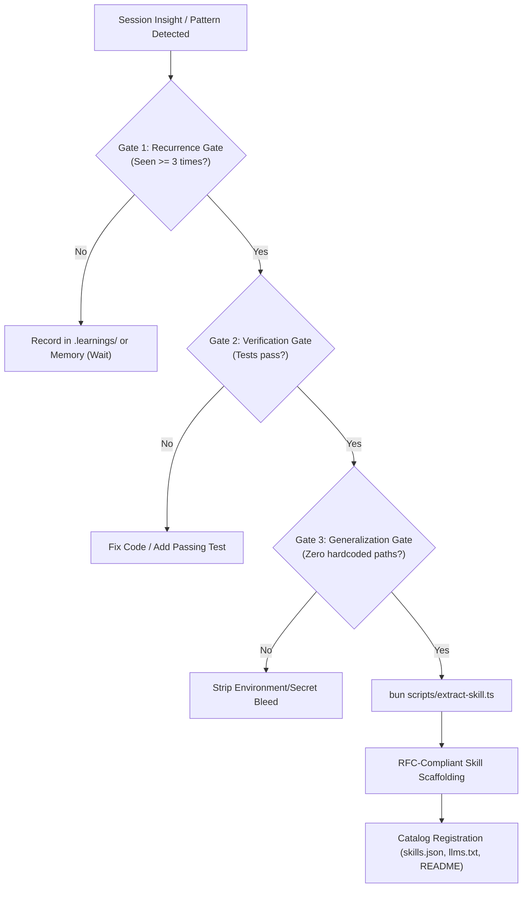

# ⚡ Self-Improvement Skill Extraction Architecture

> **Purpose**: Standard operating procedure for capturing verified, recurring problem-solving patterns into universal, RFC-compliant Agent Skills.
> **Inspiration**: Self-learning agent workflows and deterministic pattern promotion.

---

## 1. The Skill Extraction Lifecycle

When an AI agent repeatedly solves a non-trivial issue across multiple tasks, that knowledge should not remain trapped in session transcripts or ephemeral notes. Instead, it must be elevated into a permanent, discoverable Agent Skill.



---

## 2. The 3 Deterministic Extraction Gates

Every candidate skill must clear three deterministic gates before promotion:

### Gate 1: Recurrence Gate ($\ge 3$ Occurrences)
- **Rule**: Never create an agent skill for a one-off problem.
- **Verification**: The issue must be documented with at least 3 distinct occurrences across tasks, repositories, or debugging sessions (e.g., recorded in `.memory/` or `.learnings/`).
- **Failure Mode**: Premature extraction creates catalog bloat and introduces overly narrow heuristics.

### Gate 2: Verification Gate (Tested & Proven)
- **Rule**: Never scaffold an unverified or speculative pattern.
- **Verification**: The solution logic must be backed by an executable test suite or deterministic verification command (e.g., `bun test`, `cargo test`, `pytest`) that exits with code `0`.
- **Failure Mode**: Packaging broken or hallucinatory instructions that degrade agent autonomy.

### Gate 3: Generalization Gate (Environment Portability)
- **Rule**: Zero machine-specific paths, personal usernames, or project secrets.
- **Verification**: All paths must be relative or generic (`/path/to/...`); credentials must be masked or parameterized.
- **Failure Mode**: Hardcoded Linux/macOS paths or credential leaks that break when executed across different runtime environments.

---

## 3. RFC Skill Anatomy & Deliverables

Every extracted skill produces three mandatory deliverables:

1. **`SKILL.md` (Executable Agent Contract)**:
   - Standard YAML frontmatter (`name`, `description`, `version`, `author`, `license`, `platforms`, `metadata`).
   - The 5 RFC H2 sections:
     - `## When to Use`: Concrete user triggers, context symptoms, and invocations.
     - `## Quick Reference`: Summary matrix or cheat-sheet table.
     - `## Procedure`: Step-by-step numbered instructions with a Mermaid workflow diagram.
     - `## Pitfalls`: Common gotchas, anti-patterns, and drift risks.
     - `## Verification`: Executable verification suite with clear exit criteria.
2. **`README.md` (Human Documentation)**:
   - High-level overview, installation command (`npx skills add ...`), architecture overview, and test commands.
3. **`agents/openai.yaml` (Codex/OpenAI Runtime Definition)**:
   - Tool definitions and scoped system prompt for agent toolchains.

---

## 4. Extraction Helper CLI Reference

Use `scripts/extract-skill.ts` to execute automated validation and scaffolding:

```bash
# Automated Skill Extraction
bun scripts/extract-skill.ts \
  --name "memory-lease-lock" \
  --desc "Enforce distributed concurrency locks on multi-agent cognitive memory writes to prevent race conditions." \
  --occurrences 3 \
  --test-cmd "bun test tests/memory.test.ts" \
  --tags "memory,concurrency,governance" \
  --register
```

### CLI Flags & Arguments

| Flag | Argument | Description |
|:---|:---|:---|
| `-n, --name` | `<name>` | Skill name in strict kebab-case (`^[a-z0-9]+(-[a-z0-9]+)*$`). |
| `-d, --desc` | `"<desc>"` | Trigger-rich description naming user intents and activation signals. |
| `-o, --occurrences` | `<count>` | Number of observed pattern occurrences (must be $\ge 3$). |
| `-e, --evidence` | `<file\|count>` | Path to markdown learning log or explicit recurrence count. |
| `-t, --test-cmd` | `"<cmd>"` | Shell command to verify working code/tests before scaffolding. |
| `--verified` | none | Boolean flag asserting manual test verification. |
| `-p, --dest` | `<path>` | Custom destination directory (defaults to repo root or `.agents/skills`). |
| `-r, --register` | none | Automatically updates `skills.json`, `llms.txt`, and `README.md`. |
| `--dry-run` | none | Preview gate results and file scaffolding without disk writes. |
| `-f, --force` | none | Bypass gate checks or overwrite existing target directory. |
