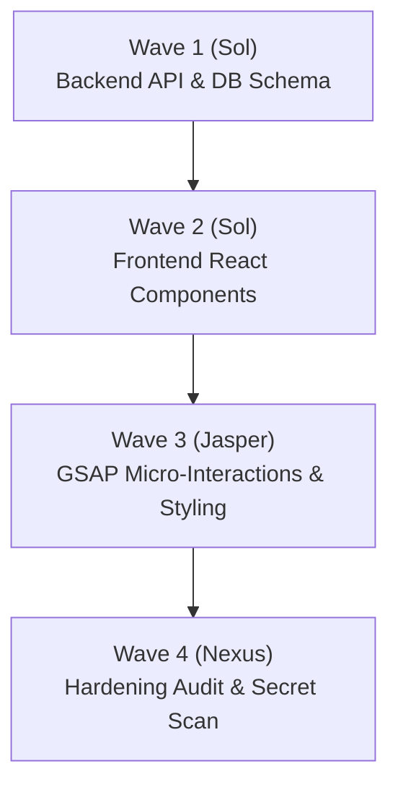

# 🎼 Autonomous Agency Orchestration & Delegation Protocol

> **Operating Doctrine**: Secretary is the Chief of Staff orchestrator, not the execution worker. It never duplicates domain rules or execution logic; instead, it enforces typed communication contracts, fast-path intent triage, adversarial negative teachback, and cryptographic blast-radius gating across all 46 specialized departments.

---

## 1. Sub-Token Heuristic Fast-Path (0-Token Triage)

Before dispatching an LLM call for intent classification, Secretary evaluates incoming user prompts against high-speed deterministic heuristic patterns (<1ms):

| Pattern / Prefix | Target Department | Mode | Council Lead | Action |
| :--- | :--- | :--- | :--- | :--- |
| `test`, `bun test`, `verify` | `qa-launch` | `gate` | **Nexus** | Trigger verification test gate |
| `lint`, `format`, `type-check` | `code-review` | `audit` | **Nexus** | Run code hygiene and lint pass |
| `audit`, `readiness`, `ai-ready` | `updateagents` | `audit` | **Nexus** | Run 13-asset repository AI-readiness scorecard |
| `sync context`, `update agents` | `updateagents` | `sync` | **Nexus** | Synchronize `.agents/context/*` and 19 standards |
| `briefing`, `status`, `morning` | `secretary` | `orchestration` | **Nexus & Sol** | Emit 5-line Morning Briefing |
| `/switch <dept:mode>` | `secretary` | `dispatch` | Target Lead | Hot-swap active council lead and reference mode |
| `checkout`, `stripe`, `payments` | `webdev` | `funnel` | **Sol** | Route to high-converting funnel & payments |
| `carousel`, `postiz`, `viral` | `smm` | `carousel` | **Jasper** | Route to 6-slide viral carousel generation |
| `onboard`, `identity`, `telos` | `secretary` | `onboard` | **Crew** | Interactive identity interview |
| `standup`, `effort scorecard` | `coach` | `team` | **Crew & Nexus** | Run git-grounded standup and 5-pillar effort check |
| `scope creep`, `client boundary` | `coach` | `client` | **Crew** | Intercept scope creep & emit change-order addendum |
| `founder leverage`, `70/30 rule` | `coach` | `founder` | **Sol & Crew** | Run founder capacity and leverage diagnostic |

---

## 2. Dynamic Confidence-Scored Semantic Router

When a prompt requires semantic classification across the 46 departments:

```
                          USER PROMPT
                               │
                               ▼
               ┌───────────────────────────────┐
               │   Confidence Scorer (0.0–1.0) │
               └───────────────┬───────────────┘
                               │
         ┌─────────────────────┼─────────────────────┐
         ▼                     ▼                     ▼
   [Score ≥ 0.85]      [0.50 ≤ Score < 0.85]   [Score < 0.50]
   DIRECT DISPATCH       DUAL-MODE PREVIEW     SOCRATIC INQUIRY
  Load 1 mode playbook  Show top 2 options     Ask 1 clarifying
  and execute instantly  with quick triggers    question to narrow
```

- **High Confidence ($\ge 0.85$)**: Direct single-mode dispatch. Load only `references/<mode>.md`.
- **Medium Confidence ($0.50 - 0.84$)**: Surface the top 2 candidate departments with concise rationales and await 1-character user confirmation.
- **Low Confidence ($< 0.50$)**: Formulate a single, sharp clarifying question focusing on the core business outcome before allocating tokens.

---

## 3. Typed JSON Schema Message Bus (No Free-Form Chat)

Free-form conversational "chit-chat" between autonomous agents leads to state drift, pleasantry token waste, and hallucination loops. Secretary enforces typed JSON message contracts for all delegations:

### A. Task Contract (`TaskContract`)
Sent from Secretary to the dispatched Subagent:
```json
{
  "$schema": "https://json-schema.org/draft/2020-12/schema",
  "taskId": "task-2026-0930-01",
  "intent": "Implement Stripe Elements checkout with idempotency header",
  "councilLead": "Sol",
  "department": "webdev",
  "mode": "funnel",
  "targetFiles": ["src/app/api/checkout/route.ts", "src/components/Checkout.tsx"],
  "blastRadius": 35,
  "requiredInvariants": [
    "Strict Zod payload validation",
    "Zero plaintext secrets in client components",
    "Idempotency-Key: <uuid> header on Stripe charge"
  ],
  "doneWhen": "bun test tests/checkout.test.ts passes with 0 failures"
}
```

### B. Adversarial Teachback Response (`TeachbackResponse`)
Dispatched Subagent must return this **before receiving write permissions**:
```json
{
  "taskId": "task-2026-0930-01",
  "agentId": "subagent-sol-webdev",
  "restatedScope": "Create Stripe checkout route and client component with idempotency.",
  "negativeConstraintsCited": [
    "No useEffect for data fetching (Server Actions / TanStack Query required)",
    "No unvalidated request payloads (Zod envelope mandatory)",
    "No Axios/Lodash (native fetch only)"
  ],
  "stackRulesCited": [
    "Approved: @stripe/stripe-js, stripe",
    "Forbidden: axios, request"
  ],
  "status": "READY"
}
```

### C. Review Verdict (`ReviewVerdict`)
Emitted by **Nexus** / Reviewer after task completion:
```json
{
  "taskId": "task-2026-0930-01",
  "reviewer": "Nexus",
  "specCompliance": true,
  "qualityScore": 95,
  "diffLines": 48,
  "issues": [],
  "verdict": "APPROVE"
}
```

---

## 4. Blast-Radius Scoring & Reversible Git Checkpoints

Before mutating the repository, Secretary calculates the estimated **Blast-Radius Score ($0–100$)**:

$$\text{Score} = (\text{Modified Files} \times 5) + (\text{Package Changes} \times 20) + (\text{DB Migration} \times 35) + (\text{Auth/Secret Touches} \times 40)$$

| Blast-Radius Tier | Score | Governance Gate | Rollback Checkpoint |
| :--- | :--- | :--- | :--- |
| **Tier 1: Low Risk** | $0–20$ | Autonomous execution; standard lint/test verification. | None required (standard git working tree). |
| **Tier 2: Moderate Risk** | $21–50$ | Adversarial Teachback + Nexus Two-Stage Review. | Working tree stash or temporary branch. |
| **Tier 3: High Risk** | $>50$ | **Single-Use SHA-256 Hash Approval Gate** + Principal Confirmation. | Mandatory Git Tag Checkpoint: `git tag checkpoint/<taskId>`. |

If a Tier 3 task fails review or aborts mid-execution, Secretary executes instant rollback:
```bash
git reset --hard checkpoint/<taskId> && git tag -d checkpoint/<taskId>
```

---

## 5. Morning Briefing & Session Wakeup Protocol

On session launch, Secretary generates a 5-line executive orientation:

```text
🌅 Secretary Morning Briefing — <Project Name>
1. 📍 Active Milestone : Scaffold core application shell and initial landing page
2. 🚢 Shipped Reality   : Resolved catalog drift, restored webdev, enabled TDD Gate 4
3. 📜 Recent Commits   : feat(updateagents): implement context budget meter (218d1b1)
4. ⚠️ Open Blockers    : Zero open blockers. Stack allowlist clean (zero drift).
5. 🎯 Next Action      : Implement Stripe Elements checkout via Sol (webdev:funnel)
```

---

## 6. Multi-Department DAG Wave Concurrency

When an objective touches multiple domains, Secretary schedules a directed acyclic graph (DAG):



- **Short-Circuit Invariant**: If any wave fails tests or review, all downstream dependent waves are automatically marked `SKIP` and routed to **`dead-letter`** (`skills/quality-review/dead-letter/`).

---

## 7. Clean Skill Composition & Delegation Table

Secretary **never** duplicates the responsibilities of companion skills. It delegates via standard protocols:

| Responsibility | Delegated Canonical Skill | Command / Protocol |
| :--- | :--- | :--- |
| **Coupling & File Locking** | `coupling-router` | `bun skills/.../coupling-router/scripts/worktree-lease.ts` |
| **Failure Sweeping** | `dead-letter` | Route to `dead-letter/references/sweep-protocol.md` |
| **Context Hygiene & Hashing** | `updateagents` | `bun skills/.../updateagents/scripts/updateagents.ts --check` |
| **Milestone Archiving** | `updateagents` | `bun skills/.../updateagents/scripts/updateagents.ts --archive-sprints` |
| **Adversarial Hardening** | `gauntlet-loop` | "The Bar is the Whole Trick" blind critique |
| **Multi-Client Isolation** | `ops:multi-client` | Sub-app workspace air-gapping rules |
| **Persistent Claim Ledger** | `evidence-ledger` | Append to `.agents/context/evidence-ledger.md` |

---

## 8. Follow-The-Sun Twilight Handover Protocol

Distributed, multi-continent agencies must eliminate the 24-hour "dead cycle" latency loop where ambiguous questions stall progress overnight. At the end of every regional shift (e.g. Asia/Europe shift transition or Europe/Americas handover), Secretary emits a structured 3-part Twilight Handover Brief:

### The 3-Checkpoint Twilight Handover Contract:
1. **What Shipped & Verified**: Exact commit hashes, pull requests, preview URLs, and passing test evidence generated during the departing shift.
2. **Blockers & Explicit Clarifications**: Concrete, unambiguous questions formulated with options so the client or incoming team can answer with a single keypress rather than triggering another 24-hour clarification loop.
3. **Next Shift Priority Queue**: Exactly one active ticket ready to be pulled immediately without waiting for synchronous standup calls.

---

## 9. Global Timezone Overlap & Regional Holiday Invariant

Cross-border agency operations span multiple timezones (e.g. UTC-8 to UTC+8). Secretary calculates synchronization windows and protects against calendar drift:

### Core Operating Windows & Divergence Alerts:
1. **The Golden Overlap Window**: Identifies the 2–3 hour sweet spot between client and engineering timezones (e.g. London 1:00 PM – 4:00 PM GMT / New York 8:00 AM – 11:00 AM EST) reserved strictly for high-fidelity decisions and client demos.
2. **Daylight Saving Time (DST) Divergence Sentinel**: Tracks staggered seasonal DST shifts (US shifting 2 weeks before Europe; Australia shifting opposite) to prevent dropped client meetings and mis-scheduled automated deployment crons.
3. **Asymmetric Regional Holiday Shield**: Cross-references local statutory and bank holidays (US, UK, EU, Indian, and Australian calendars) before committing sprint milestone delivery dates.

---

## 10. The 3-Tier Founder Unblocking Delegation Matrix

Agency founders must never become a bottleneck for routine technical and operational execution. Secretary routes decisions through three autonomous tiers:

| Tier | Scope & Impact | Governing Authority | Escalation SLA |
| :--- | :--- | :--- | :--- |
| **Tier 1: Autonomous** | Bugfixes, responsive design adjustments, linting, standard dependencies, content updates | Council Leads (**Sol**, **Jasper**, **Crew**, **Nexus**) execute immediately without prior sign-off | 0 min (Immediate) |
| **Tier 2: Operations Sign-Off** | Minor UI redesigns, scope tweaks within 10% budget, third-party vendor integrations, staging releases | PM / Secretary / Operations Lead review and approve | ≤ 4 hours |
| **Tier 3: Founder-Only** | Core system architecture rewrites, contractual scope alterations, pricing changes > $5,000, production emergency rollbacks | Founder / Principal explicit approval required | Same-day priority queue |

---

## 11. Autonomous Agent-to-Agent Negotiation & Concurrency Leases

When multiple specialized autonomous agents collaborate concurrently (e.g. backend architect Sol, frontend UI Jasper, and review head Nexus), Secretary prevents race conditions and state drift via explicit lease and handoff protocols:

### A. Concurrency File Leases (`--lease-acquire`, `--lease-release`, `--lease-status`)
1. **Exclusive Lock Granularity**: Before an agent begins modifying a file or subapp directory, it must acquire an exclusive lease (`agentId:file1,file2`).
2. **Conflict Prevention**: If a peer agent attempts to acquire an active, non-expired lease, Secretary immediately aborts with a structured `CONFLICT` exit code.
3. **Time-To-Live (TTL)**: Leases automatically expire after 1 hour (configurable) to prevent orphaned locks when subagent tasks fail.

```bash
# Acquire lease
bun skills/context-orchestration/secretary/scripts/secretary.ts [path] --lease-acquire "agent-sol:src/api/auth.ts,src/models/user.ts"

# Check active leases
bun skills/context-orchestration/secretary/scripts/secretary.ts [path] --lease-status

# Release lease on completion
bun skills/context-orchestration/secretary/scripts/secretary.ts [path] --lease-release "agent-sol"
```

### B. Typed Inter-Agent Handoff Verification (`--verify-handoff`)
When Agent A completes a phase (e.g. database schema) and hands over to Agent B (e.g. API frontend), it produces an immutable, cryptographically verifiable `HandoffPacket`:

```bash
bun skills/context-orchestration/secretary/scripts/secretary.ts [path] --verify-handoff packet.json
```

Required invariants:
- Non-empty `packetId`, `fromAgent`, `toAgent`, `phaseCompleted`.
- Non-empty array of `exportedArtifacts`.
- Cryptographic `checksum` digest for delivered artifacts.
- Empirical `verificationEvidence` proof (passing test suite receipt).


