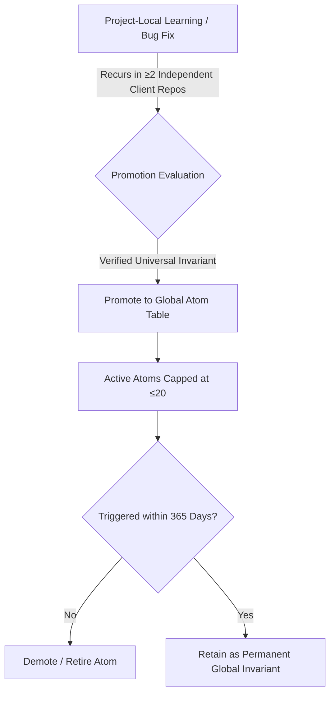

# global-atoms — The ≤20 Global Invariant Atom Table & Task Observation Loop

## Scope

- Multi-client agency cognitive architecture: maintaining global cross-project invariants without causing prompt bloat or context degradation.
- Strict enforcement of the **Global Atom Cap (≤20 active invariant atoms)**.
- Automated promotion and demotion lifecycles for learned engineering standards and operational rules.
- The **Task Observation Loop**: passively capturing user corrections and adjustments to continuously propose skill improvements.

## Deliverable

A clean, deduplicated global invariant table (`global-atoms.json` / `invariants.md`) and structured observation logs for ongoing skill evolution.

---

## 1. The ≤20 Global Atom Table Architecture

When managing dozens of agency client repositories, storing hundreds of rules in the global system prompt degrades agent reasoning and consumes valuable context tokens. 

The **Global Atom Table** solves this by maintaining a strict, finite ceiling:



### Invariant Rules for Global Atoms
1. **Strict Ceiling (≤20 Active Atoms)**:
   - At no time may the global invariant table contain more than the configured active atom cap (default baseline ≤20 active atoms, configurable up to 40 via `bun scripts/taste-engine.ts set-cap --cap=40`).
   - If a new atom is proposed when the table is full, the least-frequently triggered atom must be reviewed for consolidation or demotion.
2. **Promotion Gate (≥2 Independent Repositories)**:
   - A bug fix or coding rule learned in Client Project A remains **project-local** in `Client-A/.agents/context/decisions.md`.
   - Only when the exact same pattern recurs in Client Project B is it evaluated for promotion to the global table.
3. **Deduplication by Root Cause**:
   - Multiple manifestations of the same architectural problem are consolidated into a single root-cause invariant (e.g. all credential leak rules consolidated into the LifeOS Vibeguard Protocol).
4. **365-Day Demotion Lifecycle**:
   - Any global atom that is not triggered or referenced within 365 days is flagged for deprecation and retired to archival storage.

---

## 2. The Task Observation Loop (Self-Improving Skills)

The Task Observation loop passively monitors interactive coding sessions for evolutionary signals:

```markdown
### 1. User Corrections & Steering (Skill Deficiency Signals)
- **Trigger**: When the principal corrects the agent (e.g. "We don't use QuickBooks, we use Stripe and Cashfree").
- **Action**: Immediately log an observation:
  - Affected Skill: `accounts`
  - Gap Identified: Missing domestic gateway clearing ledgers.
  - Proposed Update: Add Cashfree AutoCollect and Razorpay Smart Collect sub-ledgers.

### 2. Repeated Manual Operations (New Skill Candidates)
- **Trigger**: When an operation is performed manually >3 times across sessions without a dedicated skill.
- **Action**: Flag as a candidate for a new modular skill or mode.

### 3. Cross-Cutting Heuristics (Global Principles)
- **Trigger**: An operational rule that proves beneficial across all projects.
- **Action**: Queue for evaluation in the Global Atom Table.
```

### Observation Log Schema (`skill-observations/`)
```markdown
| Date | Affected Skill | Trigger Type | Specific Observation | Action Taken |
|:---|:---|:---|:---|:---|
| 2026-09-20 | accounts | User Correction | Client uses Indian fintech gateways (Cashfree/Razorpay) | Added gateway clearing ledgers & scripts |
| 2026-09-21 | animate | Tool Gap | Need animated SVG technical diagrams without JS | Added technical-diagrams reference |
| 2026-09-21 | code-review | Governance | Enforce strict 5-checkpoint boundary discipline | Added boundary-governance reference |
```

## Quality Gate

- [ ] Global active atoms never exceed 20 entries.
- [ ] No project-specific client secrets or business logic promoted to global tables.
- [ ] Every promoted atom grounded in ≥2 independent verified occurrences.
- [ ] Observation logs kept concise, auditable, and actionable.

## Routing

- Synchronizing project agent context and standards → `updateagents`.
- Scaffolding new client repositories → `new-project`.
- Repository documentation drift audits → `updatedocs`.
